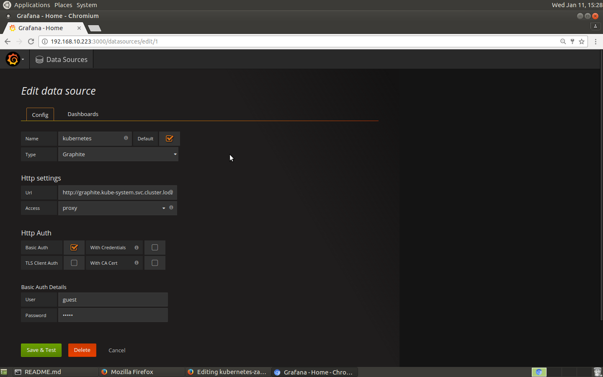
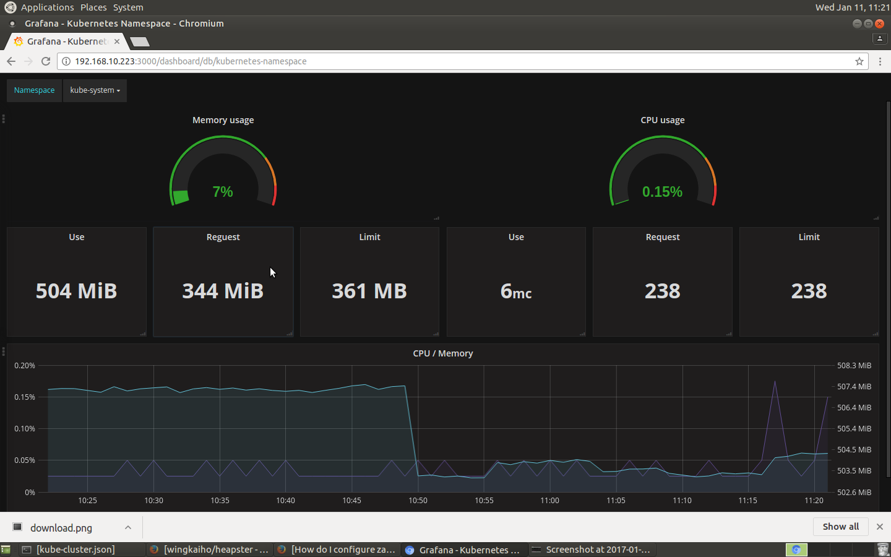
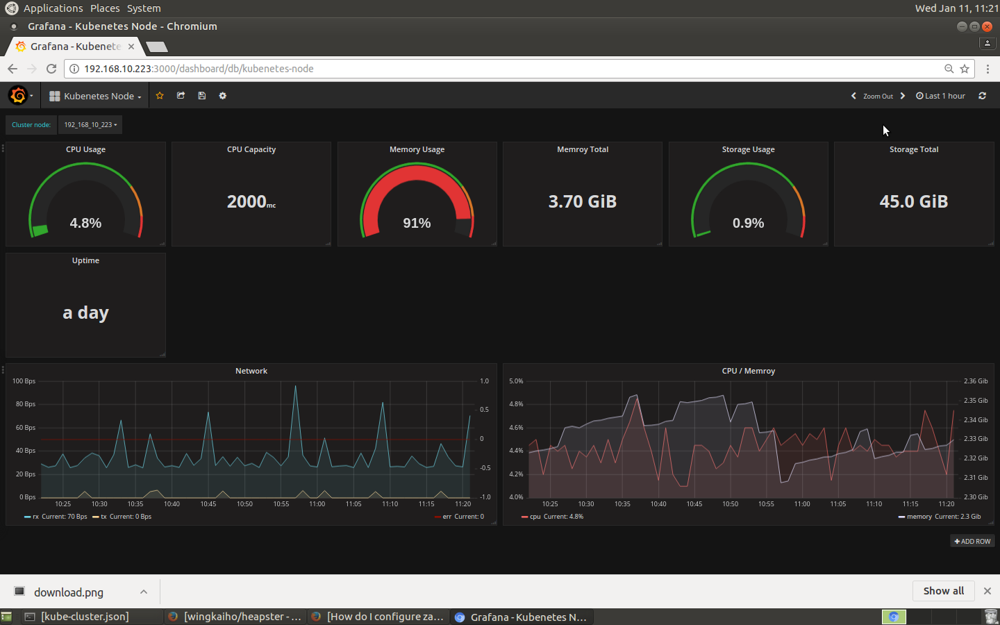

## 1. 创建graphite服务

### 1.1 创建的storage-schemas.conf 文件configmap
   configmap 存放在kube-system名字空间
```
   kubectl --namespece=kube-system create configmap graphite-storage-schemas.conf --from-file=storage-schemas.conf
```

### 1.2 storage-schemas.conf映射到路径/opt/graphite/conf/storage-schemas.conf
    volumeMounts 如果设置path为/opt/graphite/conf/, 会把整个目录都覆盖掉,如果只需要覆盖storage-schemas.conf, 需要用关键字subPath
```	
    volumeMounts:
     - name: configvolume
       mountPath: /opt/graphite/conf/storage-schemas.conf
       subPath: storage-schemas.conf
    volumes:
     - name: configvolume
       configMap:
       name: graphite-storage-schemas
```
    [graphite-rc.yaml](./graphite-rc.yaml)

### 1.3 需要导出端口
    graphite web 数据库需要导出两个端口
    1) carbon-cache 2003
    2) graphite-web 80

    [graphite-svc.yaml](./graphite-svc.yaml)
    
    graphite服务在kubenetes域名是:graphite.kube-system.svc.cluster.local

### 1.4 启动graphite服务
```
  #kubectl create -f graphite-rc.yaml
  #kubectl create -f graphite-svc.yaml
```

##2 创建heapster服务

### 2.1 创建heapster pod
  由于kubernetes原生heapster-1.2.0还没有支持graphite数据库, 使用jsoriano/heapster源码进行编译. 整合到镜像wingkaiho/heapster:v1.2.0. `heapster-controller.yml`只需要替换`kube-master-ip>`和`kube-master-port`
```
...
    - /heapster
    - --source=kubernetes:http://kube-master-ip:kube-master-port?inClusterConfig=false&useServiceAccount=true&auth=
    - --sink=graphite:tcp://graphite.kube-system.svc.cluster.local:2003?prefix=kubernetes.
...
```
  
  `graphite.kube-system.svc.cluster.local`是graphite服务的域名. 根据实际情况替换.

### 2.2 heapster 服务
    把80端口导出到集群8082

### 2.3 启动graphite服务
```
  #kubectl create -f graphite-rc.yaml
  #kubectl create -f graphite-svc.yaml
```

## 3 grafana

### 3.1 添加数据源

  Data Source -> Add data source 如图:

  

  其中
```
  name: kubernetes
  default: true
  type: graphite
  url: 可以写graphite dns地址:`graphite.kube-system.svc.cluster.local` 根据实际情况替换.
  access: proxy
 
  base auth: true
  
  Base auth detail:
  user: guest
  password: guest
```    
### 3.2 导入监控页面

  分别导入grfana/json目录下的: kube-cluster.json, kube-namespace.json, kube-node.json, kube-pod.json, 如图

  


### 3.2 监控效果图

#### 3.2.1 kube cluster


#### 3.2.2 kube namspace 


#### 3.2.3 kube node


#### 3.2.4 kube pod

